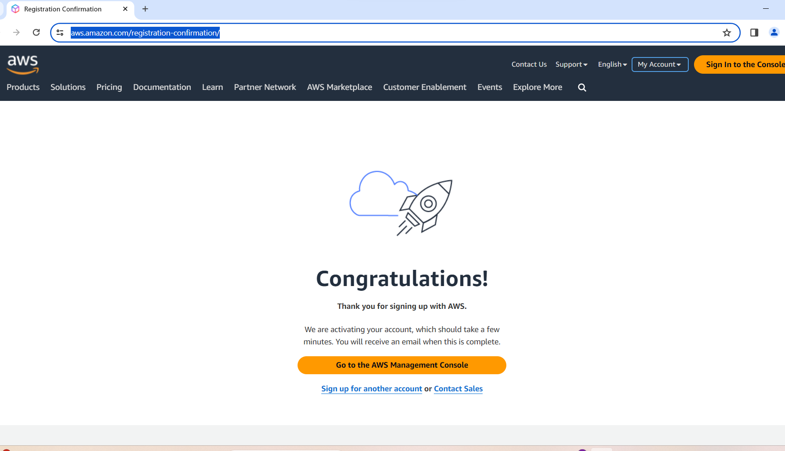

AWS Bot Registration 
This AWS bot allows you to register with AWS website and saves account data. 
The bot collects user information and performs the necessary steps 
to create an AWS account. 
Below are example the details of the account data that the bot collects:

First Name: William
Last Name: Elmer
Card Number: 0000000010100000
Card Valid Date: 07/2026
CVV: 123
Cardholder Name: William Elmer
Phone Number: +46762255058
Full Name: William Elmer
Email Address: cconfir@1secmail.net
Root Password: i#6784b@kjHb-fHq#a!pEm
Account Name: Cklgwmilss@1secmail
Email Verification Code: 021124
City: North Brian
Postal Code: 86895
Country: United States
Full Address: 2202 Mooney Center, USA

FINAL RESULT WILL BE PAGE 

Install Dependencies:
Run the following command to install the specified dependencies:
poetry install
poetry update

1) 
Create a .env file in the root directory of your project.
there is example in [.env.example](.env.example) ( <--or just CTRL + click and  edit name of this file, 
then input your data)
Add the following data to the .env file, replacing the placeholders with your actual credentials:
CAPTCHA_API_KEY = 'your_captcha_key_here' 
SIM_API_TOKEN = 'your_sim_token_here' from onlinesim.io
CVV = 'your_cvv_here'  # format example '389'
EXPIRE_DATE = 'your_expire_date_here'  # format example '02/2028'
CARD_NUMBER = 'your_card_number_here'  # format example '4585603295136'
CARDHOLDER = 'your_cardholder_name_here'  # format example 'NAME SURNAME'

2)
Usage

You can choose one of the following modes for registration account email:
Temporary Email Mode (for Tests):
Uncomment the line with CTRL and #: the line below in src/__main__.py

# aws = AwsRegistrator(email=generate_mail())  # use to generate random temporary onetime mail (for tests)
Note: Temporary emails are free and fast, but they may not always work reliably with AWS services.

OR
Gmx Account Mode:
will by default will  work the line:
aws = AwsRegistrator('yourmail_example@gmx.com', 'your_password_')

for using your mail, replace
'yourmail_example@gmx.com' with your Gmx address and 'your_password_'   [__main__.py](src/__main__.py) (CTRL click on src/__main__.py)
with your GMX email IMAP password in src/__main__.py.

Important Note for DuckDuckGo Email Aliases:
DuckDuckGo generated email aliases are designed to remove trackers and enhance privacy. 
However, messages that received with DuckDuckGo, will not be recognize these aliases via the IMAP protocol.

3)
The AWS bot maintains a aws_data.json [aws_data.json](src/data/aws_data.json) (CTRL click on it) 
file where it saves the following information:
Account details (such as name, card information, etc.)
Count of used emails (default limit: 9 times)
Count of used phone numbers (default limit: 9 times)
Count of used bank cards (default limit: 9 times)
This file is updated every time the bot registers an account.

4)
Phone Number Country Code:
By default, the bot uses a Sweden phone number (country code: +46) 
as it is cost-effective (approximately $0.12 per SMS).
If you prefer to use a different country code, 
modify the ONLINE_COUNTRY_CODE string
in the config.py file to your desired code. [config.py](src/config.py) (CTRL click on it) 

5)
By default bot will use gmx mails 
To use a different mail service such as Gmail instead of GMX, 
follow these steps in the imap_handler.py file:
Open the imap_handler.py file in  project. [imap_handler.py](src/imap_handler.py)
Locate the ImapHandler class definition. It should look like this:
Python

class ImapHandler:
    def __init__(self, user, password):
        # self.host = 'imap.gmail.com'
        self.host = 'imap.gmx.com'
        self.imap_ssl_port = 993
        self.user = user
        self.password = password
To use Gmail, uncomment the line that sets self.host to 'imap.gmail.com' and comment out the GMX line:
Python

class ImapHandler:
    def __init__(self, user, password):
        self.host = 'imap.gmail.com'  # Use Gmail IMAP server
        # self.host = 'imap.gmx.com'  # Comment out the GMX line
        self.imap_ssl_port = 993
        self.user = user
        self.password = password

6)
Run the bot using the following command:
python crypto-accounts-bot/src/__main__.py